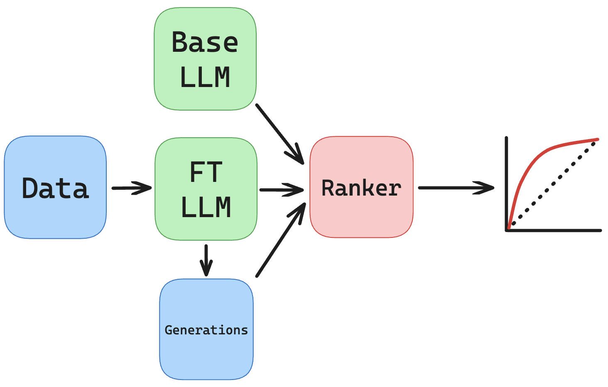

Finetune Extraction
===================

Finetune extraction is pretty similar to pretrain extraction but with the possibility of access to the base model.

The starter script of relevance is ``scripts/finetune_extraction.sh``.

.. literalinclude:: ../../../scripts/finetune_extraction.sh
   :language: bash

First, we finetune a model, then call ``run_generation.py`` to obtain our generations.

We have a strong finetuned loss ratio attack which we apply in this script.
We can also vary the prefix and suffix lengths to observe how extraction becomes more difficult with less context.

