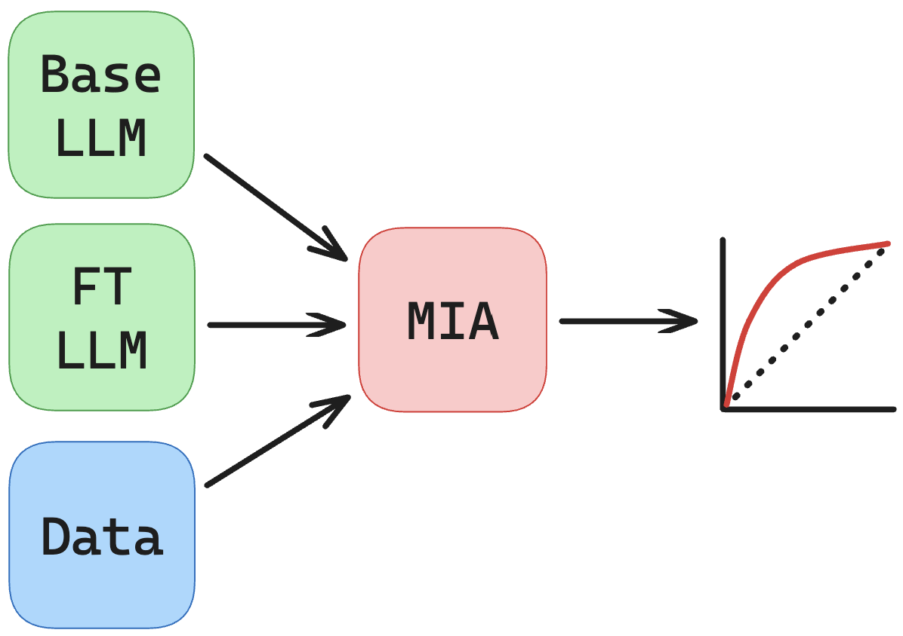

Finetuned MIA
=============
The finetuned MIA setting is almost exactly the same as the pretrained setting, but we may have access to the base model.

As found in `our paper <https://arxiv.org/abs/2402.17012>`_, a simple unsupervised loss ratio works extraordinarily well, but supervised classifiers can also be easily applied without modifications.

We can see some of these simple attacks in ``scripts/finetune_mia.sh``:

.. literalinclude:: ../../../scripts/pretrain_mia_gradnorms.sh
   :language: bash

In this case, we first train a model with ``experiments/run_train.py`` to get our finetuned model. The next steps are identical to the pretrain setting.

Though, a finetuned loss ratio requires access to the base model, which we give as an additional argument in ``experiments/run_flora.py``.

.. literalinclude:: ../../../experiments/mia/run_flora.py
   :language: py

