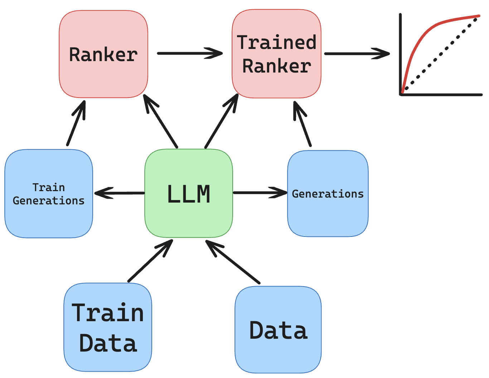

Pretrain Extraction
===================

Extraction requires a different pipeline than an MIA.

In particular, the goal is to create a large number of generations from the LLM, and assuming one of the generations was verbatim training data, then a classifier needs to be able to distinguish it from the other generations.

Again, looking at a starter script will help us understand the process: ``scripts/pretrain_extraction.sh``.

.. literalinclude:: ../../../scripts/pretrain_extraction.sh
   :language: bash

First, we call ``run_generation.py`` to obtain a large number of possible completions.

Then, we obtain gradient norms for each completion to train a supervised logistic regression and neural network ranker.

Again, the supervised classifier takes in two sets of data, one for training the classifier and one for evaluating.

``experiments/extraction/run_generation.py`` is a simple Python utility that not only generates many completions, but also outputs probabilities of generating the ground truth training data.

.. literalinclude:: ../../../experiments/extraction/run_generation.py
   :language: py

For reference, here is the schematic diagram depicting the data flow:

