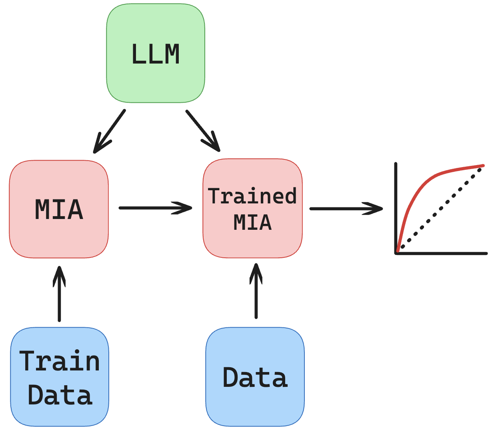

Supervised MIAs in the Pretrain Setting
=======================================

To conduct supervised attacks, we must add an additional step that involves generating two sets of train-set/val-set data.

One set will be for training our supervised classifier MIA, and the other will be for evaluating the MIA.

Take a look at ``scripts/pretrain_mia_gradnorms.sh``.

.. literalinclude:: ../../../scripts/pretrain_mia_gradnorms.sh
   :language: bash

You can see that the classifier takes in two pairs of args specifying the data: ``--clf_pos_features`` and ``--clf_neg_features`` for training the classifier, and ``--mia_train_features`` and ``--mia_val_features`` for actual evaluation.

Let's take a look into ``experiments/mia/run_logreg.py`` to see how a classifier is trained:

.. literalinclude:: ../../../experiments/mia/run_logreg.py
   :language: py

The overall procedure is similar but we have two sets of datasets to work with, and we introduce some preprocessing as well.

The exact same protocol holds for other classifiers beyond logistic regression.

