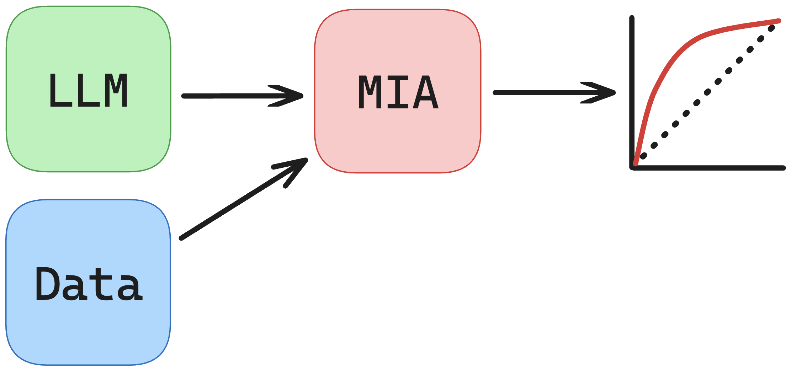

Unsupervised MIAs in the Pretrain Setting
=========================================

There are currently four types of information from a model that are targeted as promising attack statistics:

- Loss
- Loss Ratio
- First-Order Gradient
- Second-Order Gradient

Unsupervised MIAs opt for condensing these quantities to a single number that can be thresholded to determine train-set membership.

Running ``scripts/pretrain_mia_baselines.sh`` calls an experiment for each unsupervised pretrained MIA.

.. literalinclude:: ../../../scripts/pretrain_mia_baselines.sh
   :language: bash

Let's take a look at an example: ``experiments/mia/run_loss.py``

.. literalinclude:: ../../../experiments/mia/run_loss.py
   :language: py

First, we parse some command-line arguments, setting the appropriate save directories based on the name of the experiment.

Second, the experiment loads some of the model's train-set and val-set data, either from saved ``.pt`` files or from the default function.

Third, the experiment loads the model, runs the data through the model to obtain the statistics, and then outputs some results.

This is the standard procedure for all unsupervised MIAs in the pretrained setting.

